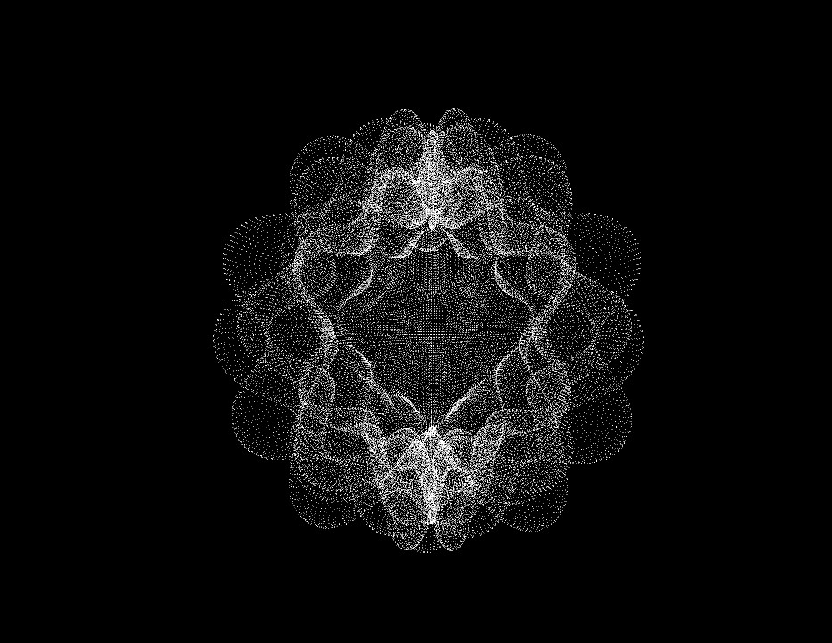

# RandomRadiusSphere
Openframeworks project about a sphere of changing radius through perlin noise and time.

Para correr el proyecto, sustituye la carpeta src en un proyecto de OpenFrameworks.
Si solo quieres divertirte con la app, descarga los archivos, abre la carpeta App y corre el archivo

